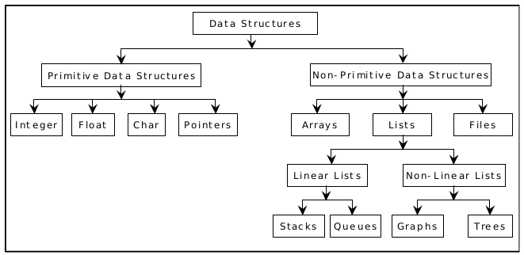
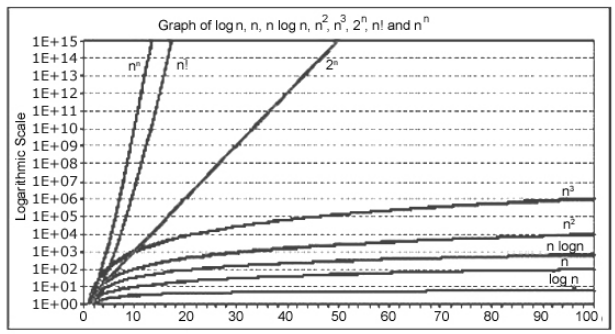

# Introduction to Data Structures

Data structure is a representation of logical relationship existing between individual elements of data. In other words, a data structure defines a way of organizing all data items that considers not only the elements stored but also their relationship to each other. The term data structure is used to describe the way data is stored.

## Linear data structure

Its elements form a sequence or a linear list:

-   array
-   stacks
-   queues
-   linked lists

## Non linear data structure

Its elements form a hierarchical classification where data items appear at various levels

-   Trees
-   Graphs

Data structures are divided into two types:

-   Primitive data structures
-   Non-primitive data structures

**Primitive data structures:** basic data structures that directly operate upon the machine instructions

**Non primitive data structures:** more complicated, derived from primitive data structures.

## Selecting a data structure to match the operation

The most important process in designing a problem involves choosing which data structure to use. The choice depends greatly on the type of operations you wish to perform.

For example, if we have a sequence of objects and we want to delete one from it using an array is too costly because removing an item in an array causes the re-indexing of the other objects. With a doubly linked list (with previous and next pointers) we can remove a single item without touching the rest.

# Algorithm

An algorithm is a finite sequence of instructions, each of which has a clear meaning and can be performed with a finite amount of effort in a finite length of time. No matter what the input values may be, an algorithm terminates after executing a finite number of instructions.

## Algorithms design

There are three basic design goals that we should strive for in a program:

1. Try to save time (Time complexity).
2. Try to save space (Space complexity).
3. Try to save face.

We want to “save face” by preventing the program from locking up or generating reams of garbled data.

### Time complexity

The time needed by an algorithm expressed as a function of the size of a problem is called the TIME COMPLEXITY of the algorithm. The time complexity of a program is the amount of computer time it needs to run to completion.

The limiting behavior of the complexity as size increases is called the asymptotic time complexity. It is the asymptotic complexity of an algorithm, which ultimately determines the size of problems that can be solved by the algorithm.

### Space complexity

The space complexity of a program is the amount of memory it needs to run to completion. The space needed by a program has the following components:

-   Instruction space: the space needed to store the compiled version of the program instructions

-   Data space: the space needed to store all constant and variables values.

## Classification of Algorithms

If ‘n’ is the number of data items to be processed:

-   **O(1):** Running time is constant no matter how big the input is

-   **log n:** This running time commonly occurs in programs that solve a big problem by transforming it into a smaller problem, cutting the size by some constant fraction.

-   **n:** When the running time of a program is linear, it is generally the case that a small amount of processing is done on each input element.

-   **n log n:** Algorithms that solve a problem by breaking it up into smaller sub-problems, solving them independently, and then combining the solutions.

-   **n²:** Quadratic running times typically arise in algorithms that process all pairs of data items (perhaps in a double nested loop) whenever n doubles, the running time increases four fold.

-   **2^n:** Whenever n doubles, the running time squares, this is a classical brute-force algorithm.

