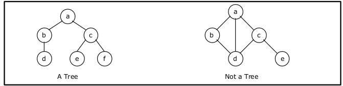
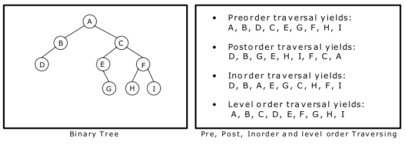

# Binary Trees

Trees and Graphs are widely used non-linear data structures. Tree and graph structures represents hieratchial relationship between individual data elements. Graphs are nothing but trees with certain restrictions removed.

## Trees

A tree is hierarchical collection of nodes. One of the nodes, known as the root, is at the top of the hierarchy. Each node can have at most one link coming into it. The node where the link originates is called the parent node. The root node has no parent. The links leaving a node (any number of links are allowed) point to child nodes. Trees are recursive structures. Each child node is itself the root of a subtree. At the bottom of the tree are leaf nodes, which have no children.



In a tree data structure, there is no distinction between the various children of a node i.e., none is the "first child" or "last child". A tree in which such distinctions are made is called an ordered tree, and data structures built on them are called ordered tree data structures. Ordered trees are by far the commonest form of tree data structure.

### Binary trees

Each node can have at most two children. A binary tree is either empty or conists of a node called the root together with two binary trees called the left subtree and the right subtree.

```
│           ┌── 8
│       ┌── 6
│       │   └── 5
│   ┌── 5
│   │   │   ┌── 4
│   │   └── 3
│   │       └── 8
└── 2
    │       ┌── 5
    │   ┌── 6
    │   │   └── 4
    └── 7
        │   ┌── 8
        └── 2
            └── 5
```

#### Terminology

-   leaf node: node with no children

-   path: A sequence of nodes n_1 , n_2 , . . ., n_k , such that n_i is the parent of n_i + 1 for i = 1, 2,. . ., k - 1. The length of a path is 1 less than the number of nodes on the path. Thus there is a path of length zero from a node to itself.

-   sibilings: children of the same parent
-   ancestor and descendent: if there's a path from node A to node B, then A is called an ancestor of B and B is called a descendent of A
-   subtree: any node of a tree with all of its descendants
-   level: distance of a node from the root
-   height: maximum level in a tree
-   depth: number of nodes along the path from the root to a node

#### Traversing binary trees

A tree traversal is a method of visiting every node in the tree.

There are four common ways to traverse a binary tree:

-   Inorder: the root of each subtree is visited after its left subtree has been traversed but before the trversal of its right subtree begins
    1. visit the left subtree, using inorder
    2. visit the root
    3. visit the right subtree, using inorder
-   Preorder: each root node is visited before its left and right subtrees are traversed. This is also called **backtracking**
    1. visit the root
    2. visit left subtree using preorder
    3. visit right subtree using preorder
-   Postotder: each root is visited after its left and right subtrees have benn traversed
    1. visit left subtree using postorder
    2. visit right subtree using postorder
    3. visit the root
-   Level order: the nodes are visited level by level starting from the root, and going from left to right. This requires a queue data structure. This is nothing but a **breadth first search**

In the first three traversal methods, the left subtree of a node is travered before the right subtree.


