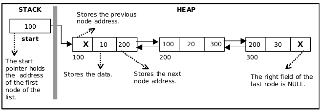

# Double Linked Lists

A double linked list is a two-way list in which all nodes will have two links:

-   left: points to the predecessor node
-   right: point to the successor node
-   data

### Basic operations

-   Creation
-   Insertion
-   Deletion
-   Traversing
